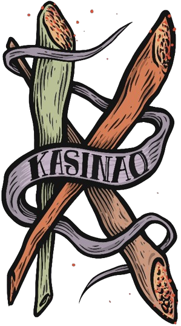

[](https://reactjs.org/)
[](https://vitejs.dev/)
[](https://www.typescriptlang.org/)
[](https://reactrouter.com/)
[](https://eslint.org/)

# Kasinao Truco

**Kasinao Truco** é o marcador de pontos digital oficial do Kasinao, feito com React + Vite + TypeScript. O app permite acompanhar a pontuação das duplas, gerenciar o coringa atual e anterior, e visualizar a ordem dos jogadores na mesa.

[](https://www.instagram.com/kasinao_truco/)


**Créditos:**
Criado por [Marcelo Pinto](https://github.com/pinto-marcelo) e adaptado para React por [Emanuel Ozorio](https://github.com/itsManeka).

---

## ✨ Funcionalidades

* 🎯 **Contagem de Pontos**: Adicione ou subtraia pontos das duplas.
* 🃏 **Gestão de Coringa**: Defina o valor do coringa (1 a 13) e acompanhe o coringa anterior.
* 🔄 **Ordem dos Jogadores**: Visualize quem é a "mão" da rodada.
* 📝 **Nomes Personalizáveis**: Personalize os nomes das duplas e jogadores.
* 💾 **Persistência Local**: Os dados são salvos no armazenamento local do navegador.
* ♻️ **Reset do Jogo**: Reinicie a pontuação e dados do jogo com um clique.
* 🔊 **Efeito Sonoro**: Reproduz um som ao adicionar 3 pontos a uma dupla.

---

## 🛠 Tecnologias Utilizadas

* [React](https://reactjs.org/)
* [TypeScript](https://www.typescriptlang.org/)
* [Vite](https://vitejs.dev/)
* HTML + CSS

---

## 🚀 Como Rodar o Projeto

### Pré-requisitos

* Node.js e npm ou yarn instalados.

### Instalação

```bash
git clone https://github.com/itsManeka/kasinao-marcador-truco
cd kasinao-marcador-truco
npm install   # ou yarn install
```

### Execução

```bash
npm run dev   # ou yarn dev
```

---

## 📁 Estrutura do Projeto

```
public/
├── assets/
│   └── img/
│       └── K.png          # Imagem de background
│   └── sounds/
│       └── kasino.mp3     # Efeito sonoro de 3 pontos
src/
├── components/
│   ├── JokerSection.tsx   # Gerencia o coringa atual e anterior
│   ├── PointButton.tsx    # Botão reutilizável para pontuação
|   ├── TableSection.tsx   # Exibe e gerencia os jogadores na mesa
│   └── TeamCard.tsx       # Exibe nome, pontuação e botões da dupla
├── pages/
│   └── Home.tsx           # Página principal com o estado global do jogo
├── App.tsx                # Componente principal da aplicação
├── types.ts               # Definições de tipos do jogo
```

---

## 🤝 Contribuição

Contribuições são muito bem-vindas!
Sinta-se à vontade para abrir uma *issue* ou enviar um *pull request*.

---

## 📄 Licença

Este projeto é open source para fins não comerciais.  
Consulte o arquivo [LICENSE](./LICENSE) para mais detalhes.
